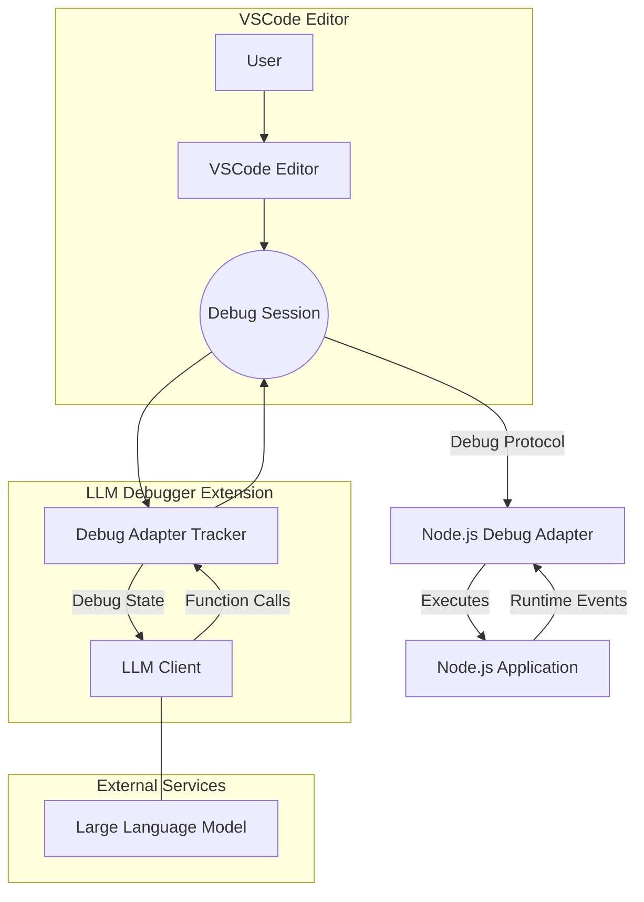

# LLM Debugger

LLM Debugger is a VSCode extension that demonstrates the use of large language models (LLMs) for active debugging of programs. This project is a **proof of concept** developed as a research experiment and will not be actively maintained or further developed.


https://github.com/user-attachments/assets/8052f75f-bc3f-4382-97f7-b1e01936df47


## Overview

Traditional LLM-based debugging approaches analyze only static source code. With LLM Debugger, the LLM is provided with real-time runtime context including:
- **Runtime Variable Values:** Observe actual variable states as the program executes.
- **Function Behavior:** Track how functions are called, what values they return, and how they interact.
- **Branch Decisions:** Understand which code paths are taken during execution.

This enriched context allows the LLM to diagnose bugs faster and more accurately. The extension also has the capability to generate synthetic data by running code and capturing execution details beyond the static source, offering unique insights into program behavior.




## Key Features

- **Active Debugging:** Integrates live debugging information (variables, stack traces, breakpoints) into the LLM’s context.
- **Automated Breakpoint Management:** Automatically sets initial breakpoints based on code analysis and LLM recommendations.
- **Runtime Inspection:** Monitors events like exceptions and thread stops, gathering detailed runtime state to guide debugging.
- **Debug Operations:** Supports common debugging actions such as stepping over (`next`), stepping into (`stepIn`), stepping out (`stepOut`), and continuing execution.
- **Synthetic Data Generation:** Captures interesting execution details to generate data that extends beyond static code analysis.
- **Integrated UI:** Features a sidebar panel within the Run and Debug view that lets you toggle AI debugging and view live LLM suggestions and results.

## Commands and Contributions

- **Start LLM Debug Session:**  
  - Command: `llm-debugger.startLLMDebug`  
  - Description: Launches an AI-assisted debugging session. Once activated, the extension configures the debugging environment for Node.js sessions and starts gathering runtime data for LLM analysis.

- **Sidebar Panel:**  
  - Location: Run and Debug view  
  - ID: `llmDebuggerPanel`  
  - Description: Displays the current state of the AI debugging session. Use the control panel to toggle "Debug with AI" mode. It shows live debugging insights, LLM function calls, and final debug results.

- **Debug Configuration Provider & Debug Adapter Tracker:**  
  - Automatically integrated with Node.js debug sessions.  
  - Injects LLM context into the session by reading the workspace state flag `llmDebuggerEnabled` and automatically setting breakpoints and handling debug events (e.g., exceptions, thread stops).
  - Supports LLM-guided commands for common operations like `next`, `stepIn`, `stepOut`, and `continue`.

## Configuration

The extension maintains a single configuration flag (`llmDebuggerEnabled`) stored in the workspace state. This flag determines whether AI-assisted debugging is enabled. You can toggle this option via the sidebar panel. No additional settings are exposed in the Settings UI.

## How It Works

1. **Session Initialization:**  
   When you launch a Node.js debug session (or use the command `llm-debugger.startLLMDebug`), the extension activates and attaches its debug adapter tracker to the session.

2. **Breakpoint Management:**  
   The extension automatically sets initial breakpoints based on an analysis of the workspace code. It then monitors runtime events to adjust breakpoints or trigger LLM actions as needed.

3. **Runtime Inspection:**  
   As the debug session progresses, the extension gathers live data including variable values, stack traces, and output (stderr/stdout). This data is sent to the LLM to determine the next debugging steps.

4. **LLM Guidance and Action Execution:**  
   The LLM processes the combined static and runtime context to suggest actions such as stepping through code or modifying breakpoints. These actions are executed automatically, streamlining the debugging process.

5. **Session Termination:**  
   When the debug session ends (either normally or due to an exception), the extension collects final runtime data and generates a summary with a code fix and explanation based on the LLM’s analysis.

## Installation

You can install LLM Debugger in VSCode using the "Install from VSIX" feature:

1. **Build the Extension Package:**
   - Run the following command in the project root to build the extension:
     ```bash
     npm run build
     ```

2. **Install the Extension in VSCode:**
   - Open VSCode.
   - Press `Ctrl+Shift+P` (or `Cmd+Shift+P` on macOS) to open the Command Palette.
   - Type and select **"Extensions: Install from from location..."**.
   - Browse to the directory of this repo
   - Reload VSCode if prompted.

Alternatively, if you prefer to load the extension directly from the source for development:
- Open the project folder in VSCode.
- Run the **"Debug: Start Debugging"** command to launch a new Extension Development Host.

## Use Cases

- **Faster Bug Resolution:**  
  The integration of runtime state with static code provides the LLM with a comprehensive view, enabling quicker identification of the root cause of issues.

- **Enhanced Debugging Workflow:**  
  Developers benefit from real-time, AI-driven insights that help navigate complex codebases and manage debugging tasks more efficiently.

- **Research & Data Generation:**  
  The tool can be used to generate synthetic runtime data for research purposes, offering new perspectives on program behavior that static analysis cannot capture.

---

LLM Debugger is an experimental project showcasing how combining live debugging data with LLM capabilities can revolutionize traditional debugging practices.
