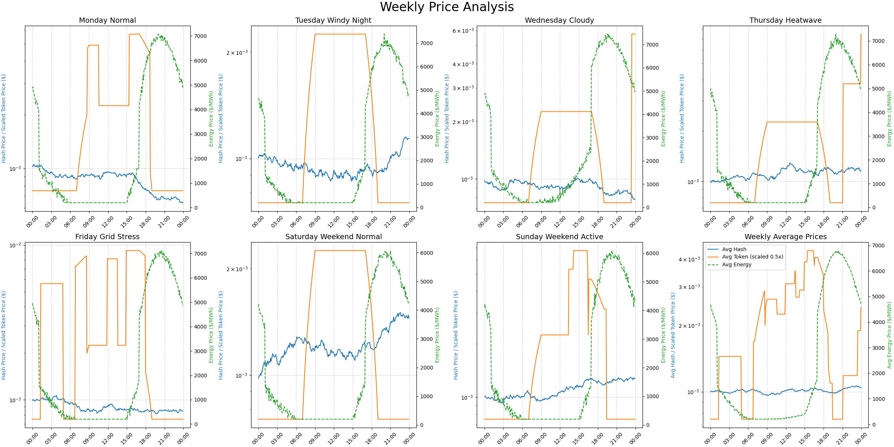
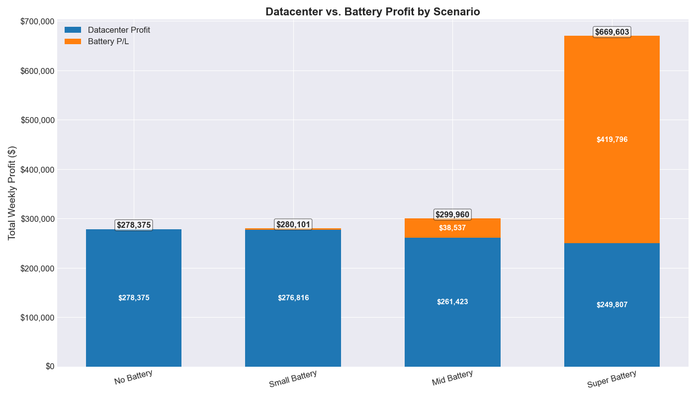

# Mara Power Arbitrage Simulation

This project simulates a power arbitrage strategy for a data center with a fixed power limit. It models a competitive market between cryptocurrency mining and high-performance computing (HPC) tasks, allowing the strategy to dynamically allocate power to the most profitable activity based on fluctuating prices for hashrate, HPC tokens, and energy.

## Simulated Weekly Price Data

The simulation runs on a week of synthetically generated price data, designed to mimic various real-world market conditions like heatwaves, grid stress, and normal daily volatility.



## Comparative Arbitrage Results

Simulations were run for four distinct scenarios to measure the impact of adding a Battery Energy Storage System (BESS) of varying sizes. The strategies were adjusted for each battery size, with larger batteries using more aggressive trading thresholds (buying and selling more frequently).

-   **No Battery**: The baseline datacenter operation.
-   **Small Battery**: A 100 kWh battery using a 10/90 percentile trading strategy.
-   **Mid Battery**: A 1 MWh battery using a 15/85 percentile trading strategy.
-   **Super Battery**: A 10 MWh battery using a 20/80 percentile trading strategy.



### Summary of Weekly Profits

| Scenario        | Datacenter Profit | Battery P/L     | Total Weekly Profit | % Increase vs. No Battery |
| :-------------- | :---------------- | :-------------- | :------------------ | :------------------------ |
| No Battery      | `$278,375.35`     | `$0.00`         | `$278,375.35`       | `0.00%`                   |
| Small Battery   | `$276,816.19`     | `$3,285.26`     | `$280,101.45`       | `0.62%`                   |
| Mid Battery     | `$261,422.95`     | `$38,537.16`    | `$299,960.11`       | `7.75%`                   |
| Super Battery   | `$249,806.73`     | `$419,795.99`   | `$669,602.72`       | `140.54%`                 |

### Conclusion

The results clearly demonstrate the significant financial advantages of integrating a BESS with a datacenter.

1.  **Profitability Scales with Battery Size**: Adding a battery, regardless of size, was profitable. The total weekly profit increased with each step up in battery capacity, culminating in the "Super Battery" scenario which more than doubled the site's total profit.

2.  **Datacenter Profit vs. Battery Profit**: An interesting trade-off emerges as the battery size increases. The datacenter's own profit decreases because the larger batteries require more power from the site's fixed 1MW limit during charging intervals. However, the profit generated by the battery's arbitrage activities far outweighs this reduction.

3.  **Shift in Business Strategy**: With the "Super Battery," the primary profit center shifts from datacenter operations to energy arbitrage. The battery's profit (`~$420k`) is substantially higher than the datacenter's (`~$250k`). This suggests that for sites with access to large-scale energy storage, the most profitable strategy may be to treat the datacenter as a secondary, opportunistic load rather than the primary business.

4.  **The Value of Flexibility**: The battery provides immense financial flexibility, allowing the site to not only power its own operations with cheaper stored energy but also to actively earn revenue by selling power back to the grid during high-price events. This turns a simple cost center (energy) into a dynamic revenue stream.

---

## Raw Simulation Results

### No Battery

```
==================================================
               Weekly Arbitrage Stats
==================================================
- Profit for monday_normal            : $      53,181.74
- Profit for tuesday_windy_night      : $      58,226.71
- Profit for wednesday_cloudy         : $      36,890.47
- Profit for thursday_heatwave        : $      34,048.26
- Profit for friday_grid_stress       : $      38,049.35
- Profit for saturday_weekend_normal  : $      31,306.60
- Profit for sunday_weekend_active    : $      26,672.24
--------------------------------------------------
Total Weekly Profit: $278,375.35
--------------------------------------------------
Optimal Allocation Frequencies (per 5-min interval):
- air_miners               :     0 intervals
- hydro_miners             :   686 intervals
- immersion_miners         :     0 intervals
- gpu_compute              :     0 intervals
- asic_compute             :   696 intervals
- none                     :   634 intervals
==================================================
```

### Small Battery (100 kWh)

```
================================================================================
     Weekly Arbitrage Stats
================================================================================
- monday_normal            : Total: $53,495.12 (DC: $52,833.36, Batt: $  661.76)
- tuesday_windy_night      : Total: $58,700.52 (DC: $58,038.17, Batt: $  662.35)
- wednesday_cloudy         : Total: $37,062.31 (DC: $36,397.75, Batt: $  664.56)
- thursday_heatwave        : Total: $34,525.07 (DC: $33,863.06, Batt: $  662.01)
- friday_grid_stress       : Total: $38,545.37 (DC: $37,890.80, Batt: $  654.58)
- saturday_weekend_normal  : Total: $31,100.82 (DC: $31,120.82, Batt: $  -20.00)
- sunday_weekend_active    : Total: $26,672.24 (DC: $26,672.24, Batt: $    0.00)
--------------------------------------------------------------------------------
Total Weekly Profit: $280,101.45
 -> Datacenter Profit: $276,816.19
 -> Battery P/L:       $3,285.26
--------------------------------------------------------------------------------
Optimal Allocation Frequencies (per 5-min interval):
- air_miners               :     0 intervals
- hydro_miners             :   686 intervals
- immersion_miners         :     0 intervals
- gpu_compute              :     0 intervals
- asic_compute             :   696 intervals
- none                     :   634 intervals
--------------------------------------------------------------------------------
Battery Action Frequencies (per 5-min interval):
- charge                   :   120 intervals
- discharge                :   100 intervals
- run_on_grid              :     0 intervals
- hold                     :  1796 intervals
================================================================================
```

### Mid Battery (1 MWh)

```
================================================================================
     Weekly Arbitrage Stats
================================================================================
- monday_normal            : Total: $56,048.25 (DC: $49,697.94, Batt: $6,350.32)
- tuesday_windy_night      : Total: $62,701.36 (DC: $56,341.29, Batt: $6,360.08)
- wednesday_cloudy         : Total: $38,368.61 (DC: $31,963.31, Batt: $6,405.31)
- thursday_heatwave        : Total: $38,455.37 (DC: $32,196.29, Batt: $6,259.07)
- friday_grid_stress       : Total: $42,788.32 (DC: $36,463.84, Batt: $6,324.48)
- saturday_weekend_normal  : Total: $33,734.77 (DC: $29,448.86, Batt: $4,285.90)
- sunday_weekend_active    : Total: $27,863.43 (DC: $25,311.42, Batt: $2,552.01)
--------------------------------------------------------------------------------
Total Weekly Profit: $299,960.11
 -> Datacenter Profit: $261,422.95
 -> Battery P/L:       $38,537.16
--------------------------------------------------------------------------------
Optimal Allocation Frequencies (per 5-min interval):
- air_miners               :     0 intervals
- hydro_miners             :   686 intervals
- immersion_miners         :     0 intervals
- gpu_compute              :     0 intervals
- asic_compute             :   696 intervals
- none                     :   634 intervals
--------------------------------------------------------------------------------
Battery Action Frequencies (per 5-min interval):
- charge                   :   135 intervals
- discharge                :   124 intervals
- run_on_grid              :     0 intervals
- hold                     :  1757 intervals
================================================================================
```

### Super Battery (10 MWh)

```
================================================================================
     Weekly Arbitrage Stats
================================================================================
- monday_normal            : Total: $108,399.78 (DC: $47,375.41, Batt: $61,024.37)
- tuesday_windy_night      : Total: $116,043.52 (DC: $55,084.34, Batt: $60,959.18)
- wednesday_cloudy         : Total: $92,731.59 (DC: $28,678.53, Batt: $64,053.06)
- thursday_heatwave        : Total: $92,072.24 (DC: $31,410.75, Batt: $60,661.49)
- friday_grid_stress       : Total: $96,218.97 (DC: $35,406.84, Batt: $60,812.13)
- saturday_weekend_normal  : Total: $84,325.74 (DC: $28,210.37, Batt: $56,115.36)
- sunday_weekend_active    : Total: $79,810.88 (DC: $23,640.48, Batt: $56,170.40)
--------------------------------------------------------------------------------
Total Weekly Profit: $669,602.72
 -> Datacenter Profit: $249,806.73
 -> Battery P/L:       $419,795.99
--------------------------------------------------------------------------------
Optimal Allocation Frequencies (per 5-min interval):
- air_miners               :     0 intervals
- hydro_miners             :   580 intervals
- immersion_miners         :     0 intervals
- gpu_compute              :     0 intervals
- asic_compute             :   662 intervals
- none                     :   774 intervals
--------------------------------------------------------------------------------
Battery Action Frequencies (per 5-min interval):
- charge                   :   140 intervals
- discharge                :   140 intervals
- run_on_grid              :     0 intervals
- hold                     :  1736 intervals
================================================================================
```
